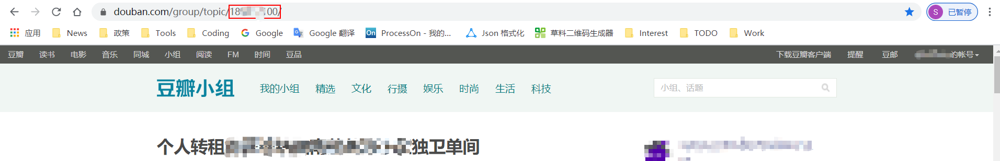

# db-comm-srv
豆瓣置顶帖服务

## 使用场景:
发布的转租贴迟迟没有得到回复,被不断更新的新帖不断打断? 最终石沉大海?

## 使用方法
这个小工具可以帮助定时每半个小时帮助评论置顶自己的帖子,置顶评论内容自定义,支持配置,使用仅需要指定douban绑定的手机号和密码,以及帖子的页面id既可使用;
 修改如下配置内容:
 `business.db.homepage.login.name`
 `business.db.homepage.login.password`
 `business.db.group.comment.commentUrl` 里面的`your_page_id`值.
 `business.db.group.comment`可以设置置顶帖追加评论的内容,这里默认设置为**"up"**,评论内容可自定义.

`your_page_id`值的获取方式:

